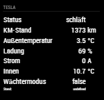
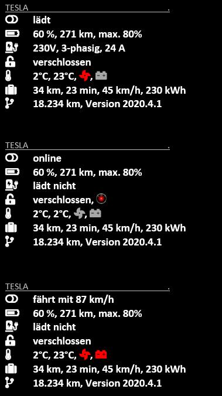

# Teslalogger

Attention: early prototype!

Module for [MagicMirror](https://github.com/MichMich/MagicMirror/) showing data from the [Teslalogger](https://github.com/bassmaster187/TeslaLogger) subscribed to via MQTT.

This module is based on [MMM-MQTT](https://github.com/ottopaulsen/MMM-MQTT) and would not have been possible without the work of [Otto Paulsen](https://github.com/ottopaulsen). Thanks a lot for your work!

## Screenshot

here is the present view



this is how it should look like (variant 1)



(variant 2)


font awesome icons:
<i class="fas fa-toggle-off"></i>
<i class="fas fa-battery-three-quarters"></i>
<i class="fas fa-charging-station"></i>
<i class="fas fa-unlock-alt"></i>
<i class="fas fa-thermometer-half"></i>
<i class="fas fa-suitcase"></i>
<i class="fas fa-fan"></i>
<i class="fas fa-car-battery"></i>
<i class="fas fa-code-branch"></i>


## Installation

Go to `MagicMirror/modules` and write

    git clone https://github.com/spitzlbergerj/MMM-Teslalogger
    cd MMM-Teslalogger
    npm install


## Configuration

Here is an example configuration with description. Put it in the `MagicMirror/config/config.js` file:

```javascript
{
    module: 'MMM-TeslaLogger',
    position: 'top_right',
    header: 'Tesla',
    config: {
        mqttServerAddress: '000.000.000.000',  // Server address or IP address
        mqttServerPort: '1883',          // Port number if other than default
        // mqttServerUser: '',          // Leave out for no user
        // mqttServerPassword: '',  // Leave out for no password
        logging: true,
		localeStr: 'de-DE',
        maxAgeSeconds: 36000,    // Reduce intensity if values are older
		style: "lines",

        displayState: true,
        displayOdometer: true,
        displayOutside_temp: true,
        displayBattery_level: true,
        displayCharger_actual_current: true,
        displayInside_temperature: true,
        displaySentry_mode: true,
    }
},
```

more to come ......


